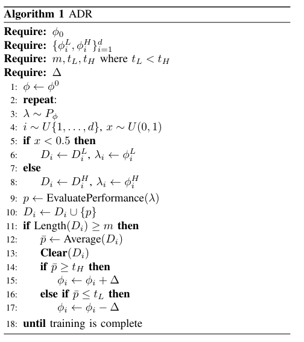
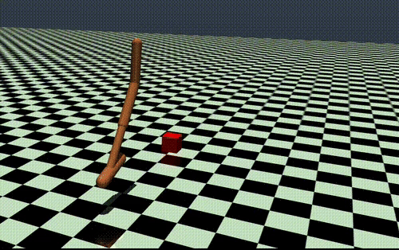

# Automatic Domain Randomization for Sim-to-Sim Policy Transfer

<p>
  
  
  
  
  
</p>

Domain randomization for a PPO policy on the MuJoCo Hopper, comparing a fixed **Uniform Domain Randomization (UDR)** range against **Automatic Domain Randomization (ADR)**, the self-adjusting curriculum from OpenAI's [*Solving Rubik's Cube with a Robot Hand*](https://arxiv.org/abs/1910.07113), on policy transfer from a source to a shifted target environment. The project extends the base Hopper with a moving-obstacle variant to test both methods under a harder task.

## Background

**Domain randomization** narrows the sim-to-real gap by sampling environment dynamics from a distribution during training rather than fixing them, so the policy generalizes to the shifted parameters it meets at test time.

**Uniform Domain Randomization (UDR)** fixes that distribution's bounds up front; **Automatic Domain Randomization (ADR)** instead expands or shrinks each parameter's range automatically based on the policy's rolling performance at the current boundary, widening where the policy already succeeds, shrinking where it doesn't, removing the need to hand-tune the randomization range.



## Results

All numbers are mean episode reward ± std over held-out test episodes, policy trained on the source dynamics and evaluated on the shifted target dynamics (full tables and setup in [`docs/report.pdf`](docs/report.pdf)).

**Plain Hopper**

| Method | DR range | Reward (source → target) |
|---|---|---|
| PPO (no randomization) | — | 1090.15 ± 78.91 |
| PPO + UDR | `[0.4λ, 1.2λ]` | **1499.03 ± 168.22** |
| PPO + ADR | `[0.4λ, 1.2λ]`, thresholds (1400, 800) | 1272.17 ± 106.63 |

**Hopper + moving obstacle** (harder task, obstacle position included in the observation)

| Method | DR range | Reward (source → target) |
|---|---|---|
| PPO (no randomization) | — | 532.15 ± 45.78 |
| PPO + UDR | `[0.4λ, 1.2λ]` | 800.09 ± 302.24 |
| PPO + ADR | `[0.4λ, 1.2λ]`, thresholds (900, 300) | **1034.53 ± 125.92** |
| PPO + UDR | `[0.8λ, 1.1λ]` (deliberately mis-set, narrow) | 670.09 ± 120.98 |
| PPO + ADR | `[0.8λ, 1.1λ]`, thresholds (900, 300) | **977.10 ± 72.31** |

On the plain Hopper, UDR beats ADR: the task is simple enough that ADR's more aggressive, self-widening curriculum spends effort exploring dynamics variations the target environment never needed.

Once the task gets harder (moving obstacle), that ranking flips: ADR reaches the highest reward and, more importantly, stays strong even when the UDR range is deliberately mis-configured (narrowed to `[0.8λ, 1.1λ]`), while UDR's performance drops with it.

ADR's adaptive bounds absorb a bad hyperparameter choice that a fixed-range method cannot. This matches the difficulty-dependent behavior reported in the original ADR paper.

Full result tables (including source-to-source and target-to-target controls, and the fixed-obstacle variant) and the ADR-entropy curves that show the curriculum adapting during training are in the [report](docs/report.pdf).

### ADR on the target environment (moving obstacle)



## Project structure

```
├── src/hopper_adr/
│   ├── envs/                  Gym-registered Hopper environments (MuJoCo)
│   │   ├── custom_hopper.py       base Hopper + UDR/ADR sampling, ADRCallback
│   │   ├── custom_hopper_obs.py   moving-obstacle variant, ADRCallbackObs
│   │   ├── mujoco_env.py          MuJoCo simulation wrapper
│   │   └── assets/                MJCF model XMLs
│   ├── train.py                PPO training entry point (baseline / UDR / ADR)
│   └── demo.py                 random-policy rollout, environment smoke test
├── notebooks/colab_template.ipynb   standalone Colab setup for GPU training
├── results/
│   ├── figures/                training curves and the ADR algorithm diagram
│   └── adr_moving_obstacle.gif
├── docs/report.pdf             full write-up: theory, setup, all result tables
└── requirements.txt
```

Training artifacts (logs, checkpoints, trained models, generated plots) are written to a gitignored `outputs/` directory rather than tracked in the repo.

## Setup

Tested on Linux with Python 3.7; `mujoco-py` is not well supported on Windows, so use WSL2 or a Linux VM there.

```bash
# 1. Install MuJoCo and mujoco-py: https://github.com/openai/mujoco-py
# 2. Install the remaining dependencies
pip install -r requirements.txt

# 3. Sanity-check the environment
cd src && python -m hopper_adr.demo
```

## Usage

Run from inside `src/` so `hopper_adr` resolves as a package:

```bash
cd src

# Baseline PPO, no randomization
python -m hopper_adr.train --train_env CustomHopper-source-v0 \
    --test_env CustomHopper-target-v0 --total_timesteps 1000000

# Uniform Domain Randomization
python -m hopper_adr.train --train_env CustomHopper-source-v0 \
    --test_env CustomHopper-target-v0 --total_timesteps 1000000 --udr

# Automatic Domain Randomization, moving-obstacle variant
python -m hopper_adr.train --train_env CustomHopperWithObstacles-source-v0 \
    --test_env CustomHopperWithObstacles-target-v0 --total_timesteps 1000000 --adr

# Evaluate a trained model (loads the matching checkpoint from outputs/)
python -m hopper_adr.train --test --train_env CustomHopper-source-v0 \
    --test_env CustomHopper-target-v0 --total_timesteps 1000000 --udr
```

See `python -m hopper_adr.train --help` for the full set of training hyperparameters (learning rate, batch size, PPO epochs, ADR performance
thresholds, seed).

## Author

Niccolò Malgeri, course project for Robot Learning (01HFNOV), Politecnico di Torino.
